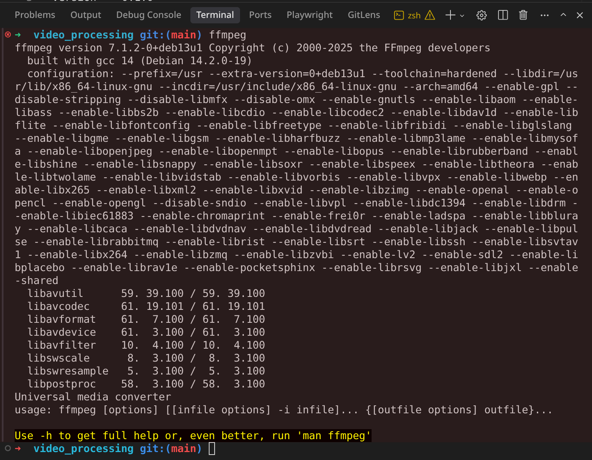
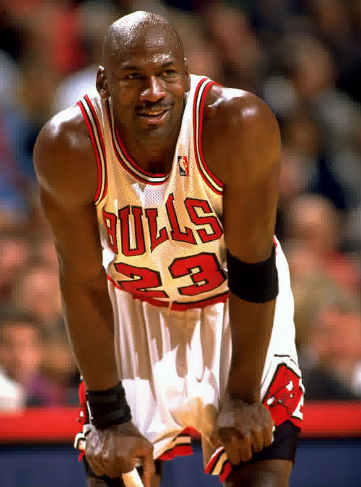

# Seminar 1

Hey! for this exercises implemented on python we used uv packet manager -> https://github.com/astral-sh/uv, on the exersises we will leave some insctructions on how to run the code smothly. Of course it can be also runned in any way you like!

## ex-1

For this first exercise we just installed ffmpeg, in this case in linux using apt packet manager
by running it on the terminal we get this result:



## ex-2

For this second exeercise we implemented the Seminar1 class with the methods:

- rgb_to_yuv: transforms from RGB space to YUV

- yuv_to_rgb: the inverse transformation

We declared this methods using the @staticmethod decorator to avoid using self notation

For running you can just run the python file (rgb values can be edited on the same file)

using uv that woud be:

```python
uv run first_seminar.py
```

uv will create a virtual environment to run the file on it

## ex-3

For this exercise we investigated diferent ways to rezise/compress an image into a lower quality.

We ended up using the -q:v factor, wich given a compression factor that can range in between

the full command we used is

```bash
ffmpeg -i image_to_resize.jpeg -q:v 31 compressed_image.jpeg
```

For the method we basicaly created a wrapper around this command, where we pass an image file path and a compression_factor

For the two images we chose we got the following results for a compression factor of 31 (the max ffmpeg allows)




## ex-4

For this exercise we implemented the `serpentine` method, which reads bytes from a JPEG file and applies the serpentine (zigzag) scanning pattern used in JPEG compression.

The method processes the file in 8x8 blocks (64 bytes each) and applies the zigzag pattern to convert the 2D matrix into a linear sequence. This pattern is used in JPEG compression after DCT and quantization to group high-frequency components together, making them more efficient for run-length encoding.

We created a helper method ( private ) for clarity `_generate_zigzag_indices`

The implementation includes:

- `_generate_zigzag_indices()`: Helper method that generates the zigzag scan pattern for an 8x8 matrix
- `serpentine(jpeg_path)`: Main method that reads the JPEG file and applies the zigzag scanning pattern

When running the script, it processes the image file and outputs the total bytes processed and the number of 8x8 blocks.

## ex-5

For this exercise we investigated how to transform an image into black and white (grayscale) and apply the hardest compression possible.

We ended up using the `-vf format=gray` filter to convert to grayscale and the `-q:v 31` factor for maximum compression.

the full command we used is

```bash
ffmpeg -i image_to_resize.jpg -vf format=gray -q:v 31 bw_max_compressed.jpg
```

For the method we basically created a wrapper around this command, where we pass an image file path and an output path.

For the image we chose we got the following results:

- Original image: 212 KB
- B/W compressed image: 33 KB
- The conversion to grayscale combined with maximum compression resulted in significant file size reduction


## ex-5.2

For this next exercise we have implemented a function that will loop trough the bytes and will detect if a byte is repeated and if so it will print it on this format: `(number of repeats, value)`

To try it out we got the first 30 bytes from the image and we runned out function with those bytes

## ex-6

We implemented the [DCT Class](s1/dct_class.py), following the formulas on the slides, we implemened a encose method and a decode method wich are inverses one of the other. To run the file you can do `bash uv run s1/dct_class.py`

## ex-7

We implemented the [DWT Class](s1/dwt_class.py) using PyWavelets library. It includes `encode` and `decode` methods that are inverses of each other. DWT decomposes images into 4 sub-bands (LL, LH, HL, HH) representing approximation and detail coefficients. To run: `uv run s1/dwt_class.py`

## Testing

Using AI, we included tests for the methods of the classes we implemented. To see how the tests are passing on the repo itself, we added a GitHub Action that runs the tests on every push to main. The results can be seen here:


### Running Tests Locally

```bash
# Run all tests
uv run pytest

```

### Test Coverage

- **DCT Class**: Tests for encode/decode methods, round-trip accuracy, edge cases
- **DWT Class**: Tests for sub-band structure, shape verification, round-trip accuracy
- **Seminar1 Class**: Tests for RGB/YUV conversion, serpentine pattern, run-length encoding, FFMPEG operations
